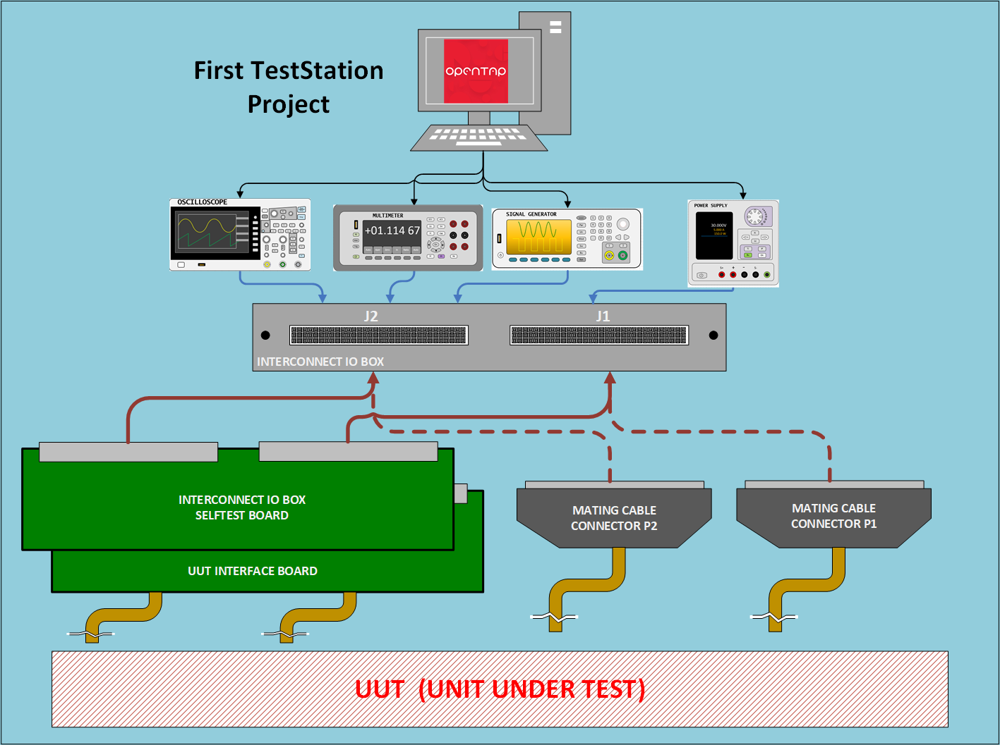

# First TestStation  100-1000-010

The FirstTestStation (FTS) project is a comprehensive solution for automating the testing and validation of electronic devices and PCBs during production. 
Designed with flexibility in mind, it integrates custom hardware, firmware, and mechanical assemblies to provide an efficient and cost-effective testing process. 

This github repositorie is used at the Root of the First TestStation Project (FTS).  
To get more details, please refer to website: [FTS_Website](https://FirstTestStation.github.io/FTS_Website/)  

 

## First TestStation Project Tree

The table below shows the FTS project tree, where the bold numbers define a GitHub repository:

| A| B | C | D| Repositorie |
|-----------------|------------------------|------------------------------------------|-----------------|----
| **100-1000-010**| **First TestStation**                    |                                           ||[FirstTestStation](https://github.com/FirstTestStation/First_TestStation)                              
|                 | 110-1000-010                            | Parts list (BOM) First Test Station       |      
|                 |**150-1000-010**                         | **FTS Website**                           ||[FTS_Website](https://github.com/FirstTestStation/FTS_Website) 
|                 | 170-1000-010                            | Assembly Diagram                          |       
|                 | 180-1000-010                            | Assembly Instruction                      | 
|                 | 200-1000-010                            | Validation Test                           |
|| **500-1000-010**| **Interconnect IO Box Assembly**        |                                          |[InterconnectIO_Box](https://github.com/FirstTestStation/InterconnectIO_Box)
||                 | 510-1000-010                            | Parts list (BOM) InterconnectIO Box      |
||                 | 512-1000-010                            | Panel Front laser cut Drawing            |
||                 | 512-1010-010                            | Panel Back panel laser cut Drawing       |
||                 | 515-1000-010                            | Left guide rail 3D Drawing               |
||                 | 515-1010-010                            | Right guide rail 3D Drawing              |
||                 | 520-1000-010                            | Box Assembly Instruction                 |
||                 | 520-1010-010                            | Box Test Instruction                     |
|| **600-1000-010**| **InterconnectIO Board Assembly**       |                                          |[InterconnectIO_Board](https://github.com/FirstTestStation/InterconnectIO_Board)
||                 | 610-1000-010                            | PCB Parts list (BOM)                     |
||                 | 640-1000-010                            | Electrical Schematics                    |
||                 | 660-1000-010                            | PCB drawing                              |
||                 | 670-1000-010                            | Assembly Drawing                         |
||                 | 680-1000-010                            | Assembly Instruction                     |
||                 | **700-2000-011**                        | **Firmware, Pico Master**                |[InterconnectIO_Master_Firmware](https://github.com/FirstTestStation/InterconnectIO_Master_Firmware)
||                 | **700-2001-011**                        | **Firmware, Pico Slave**                 |[InterconnectIO_Slave_Firmware](https://github.com/FirstTestStation/InterconnectIO_Slave_Firmware)
|| **500-1010-021**| **Selftest Box Assembly**               |                                          |[Selftest_board](https://github.com/FirstTestStation/Selftest_Board)
||                 | 510-1010-010                            | Parts list (BOM) Selftest Box            |
||                 | 600-1010-021                            | Selftest Board Assembly                  |
||                 | 610-1010-021                            | PCB Parts list (BOM)                     |
||                 | 640-1010-021                            | Electrical Schematics                    |
||                 | 660-1010-021                            | PCB drawing                              |
||                 | 670-1010-010                            | Assembly Drawing                         |
||                 | 680-1020-010                            | Assembly Instruction                     |
||                 | **700-2010-011**                        | **Firmware Pico**                        |[Selftest_code_Firmware](https://github.com/FirstTestStation/Selftest_code_firmware)
| **800-1010-010** | |**Selftest Sequence**                  | OpenTAP Sequence                         |[OpenTAP Selftest Sequence](https://github.com/FirstTestStation/FTS_OpenTAP_Selftest_Sequence)
| **800-1020-010** | |**InterconnecIO Plugin**               | OpenTAP Plugin                           |[InterconnectIO OpenTAP Plugin](https://github.com/FirstTestStation/FTS_InterconnectIOBox_OpenTAP_Plugin)
| | | |

## Documentation
- [Bill of Materials(BOM)](pdf/BOM_First_TestStationx_110-1000.pdf) – List of components required to complete the project.

## Design Files 

### Notice

The design files used in this project were instrumental in its development but do not have an official designation or number.  
They are included in the project repository for reference purposes only and should not be considered official project documentation.

- [FirstTestStation](DOC/FirstTestStation.vsdx) – Design drawing used during FTS developpment.
- [FTS_Design_layout](DOC/FTS_Design_layout.ods)– Pinout assignment for Pico controller and DIN connectors.
- [SCPI_Register](DOC/SCPI_Register.vsdx)– SCPI register diagram of the FTS.
- [I2C_protocol](DOC/I2C_protocol.ods)– help to understand I2C protocol command from SDK.
- [Selftest_Strategy](DOC/Selftest_Strategy.vsdx)– Visio drawing of the Selftest strategy used to validate the InterconnectIO Box.
- [Instruments](DOC/Instruments.vsdx)– Visio drawing of the external instruments.

